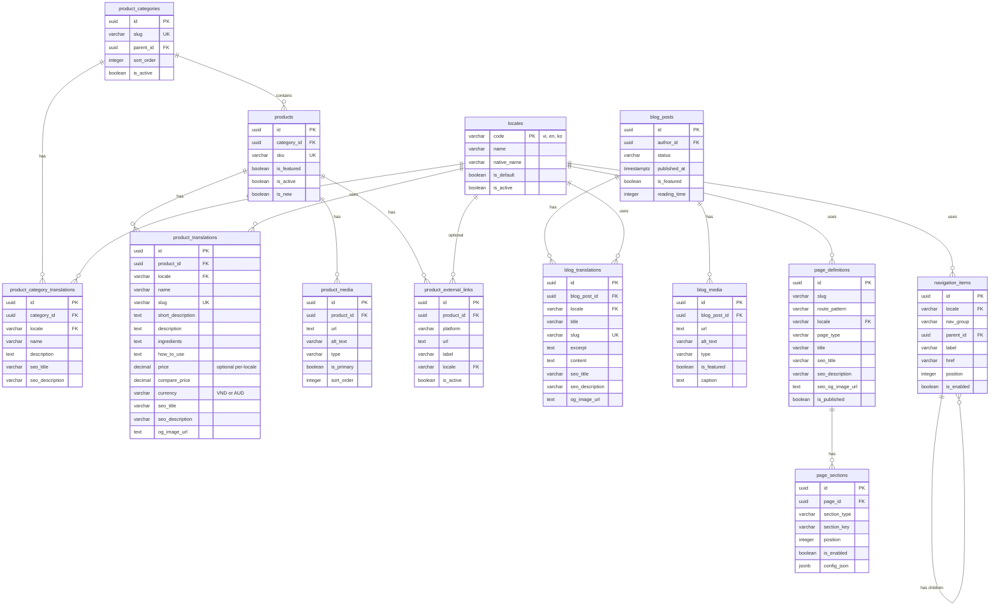

# Plumé Backend Architecture Plan

> **Status**: Awaiting Approval  
> **Last Updated**: 2025-12-09

This document outlines the Supabase backend architecture for Plumé, a modern cosmetics brand website. The schema supports products, blog posts, multilingual content (Vietnamese, English, Korean), media management via Supabase Storage, and external e-commerce links.

---

## Table of Contents

1. [Database Schema Overview](#database-schema-overview)
2. [Detailed Table Schemas](#detailed-table-schemas)
3. [Page Builder Schema](#page-builder-schema)
4. [Entity Relationship Diagram](#entity-relationship-diagram)
5. [Row Level Security (RLS) Strategy](#row-level-security-rls-strategy)
6. [API Contracts](#api-contracts)
7. [File Structure](#file-structure)
8. [Migration Strategy](#migration-strategy)

---

## Database Schema Overview


### Core Tables

| Table | Purpose |
|-------|---------|
| `locales` | Supported languages (vi, en, ko) |
| `product_categories` | Product category hierarchy |
| `products` | Base product data (non-translatable) |
| `product_translations` | Locale-specific product content + SEO |
| `product_media` | Product images/videos (Supabase Storage URLs) |
| `product_external_links` | E-commerce platform links |
| `product_feedbacks` | Admin-curated customer testimonials per product |
| `product_feedback_translations` | Locale-specific feedback content |
| `blog_posts` | Base blog post data |
| `blog_translations` | Locale-specific blog content + SEO |
| `blog_media` | Blog images/videos (Supabase Storage URLs) |
| `page_definitions` | Page builder: page routing, SEO, and metadata |
| `page_sections` | Page builder: dynamic content blocks with JSONB config |
| `navigation_items` | Site navigation structure |
| `redirects` | URL redirection rules |

---

## Detailed Table Schemas

### 1. `locales` - Language Configuration

```sql
CREATE TABLE locales (
    code        VARCHAR(5) PRIMARY KEY,       -- 'vi', 'en', 'ko'
    name        VARCHAR(50) NOT NULL,         -- 'Vietnamese', 'English', 'Korean'
    native_name VARCHAR(50) NOT NULL,         -- 'Tiếng Việt', 'English', '한국어'
    is_default  BOOLEAN DEFAULT FALSE,        -- Vietnamese is default
    is_active   BOOLEAN DEFAULT TRUE,
    created_at  TIMESTAMPTZ DEFAULT NOW()
);

-- Seed data
INSERT INTO locales (code, name, native_name, is_default) VALUES
    ('vi', 'Vietnamese', 'Tiếng Việt', TRUE),
    ('en', 'English', 'English', FALSE),
    ('ko', 'Korean', '한국어', FALSE);
```

---

### 2. `product_categories` - Category Management

```sql
CREATE TABLE product_categories (
    id          UUID PRIMARY KEY DEFAULT gen_random_uuid(),
    slug        VARCHAR(100) UNIQUE NOT NULL,  -- URL-safe identifier
    parent_id   UUID REFERENCES product_categories(id) ON DELETE SET NULL,
    sort_order  INTEGER DEFAULT 0,
    is_active   BOOLEAN DEFAULT TRUE,
    created_at  TIMESTAMPTZ DEFAULT NOW(),
    updated_at  TIMESTAMPTZ DEFAULT NOW()
);

-- Category translations (name, description per locale)
CREATE TABLE product_category_translations (
    id            UUID PRIMARY KEY DEFAULT gen_random_uuid(),
    category_id   UUID NOT NULL REFERENCES product_categories(id) ON DELETE CASCADE,
    locale        VARCHAR(5) NOT NULL REFERENCES locales(code),
    name          VARCHAR(200) NOT NULL,
    description   TEXT,
    
    -- SEO fields
    seo_title       VARCHAR(70),
    seo_description VARCHAR(160),
    
    UNIQUE(category_id, locale)
);
```

---

### 3. `products` - Base Product Data

```sql
CREATE TABLE products (
    id            UUID PRIMARY KEY DEFAULT gen_random_uuid(),
    category_id   UUID REFERENCES product_categories(id) ON DELETE SET NULL,
    sku           VARCHAR(50) UNIQUE,            -- Stock Keeping Unit
    is_featured   BOOLEAN DEFAULT FALSE,
    is_active     BOOLEAN DEFAULT TRUE,
    is_new        BOOLEAN DEFAULT FALSE,
    sort_order    INTEGER DEFAULT 0,
    created_at    TIMESTAMPTZ DEFAULT NOW(),
    updated_at    TIMESTAMPTZ DEFAULT NOW()
);

CREATE INDEX idx_products_category ON products(category_id);
CREATE INDEX idx_products_featured ON products(is_featured) WHERE is_featured = TRUE;
CREATE INDEX idx_products_active ON products(is_active) WHERE is_active = TRUE;
```

> [!NOTE]
> **Pricing moved to translations**: Prices are now per-locale in `product_translations` table, supporting VND (Vietnam) and AUD (Australia). If price is NULL for a locale, the frontend should hide the price display.

---

### 4. `product_translations` - Localized Product Content

```sql
CREATE TABLE product_translations (
    id              UUID PRIMARY KEY DEFAULT gen_random_uuid(),
    product_id      UUID NOT NULL REFERENCES products(id) ON DELETE CASCADE,
    locale          VARCHAR(5) NOT NULL REFERENCES locales(code),
    
    -- Content fields
    name            VARCHAR(200) NOT NULL,
    slug            VARCHAR(200) NOT NULL,        -- Locale-specific URL slug (auto-generated or admin-edited)
    short_description TEXT,
    description     TEXT,                          -- Rich HTML content
    ingredients     TEXT,
    how_to_use      TEXT,
    
    -- Per-locale pricing (optional - hidden if NULL)
    price           DECIMAL(12, 2),               -- NULL = price not displayed
    compare_price   DECIMAL(12, 2),               -- Original price for discounts
    currency        VARCHAR(3) DEFAULT 'VND',     -- 'VND' or 'AUD'
    
    -- SEO fields
    seo_title       VARCHAR(70),                  -- Max recommended for Google
    seo_description VARCHAR(160),                 -- Meta description
    seo_keywords    TEXT,                         -- Comma-separated
    og_image_url    TEXT,                         -- Open Graph image (Bunny CDN)
    
    created_at      TIMESTAMPTZ DEFAULT NOW(),
    updated_at      TIMESTAMPTZ DEFAULT NOW(),
    
    UNIQUE(product_id, locale),
    UNIQUE(locale, slug)                          -- Slug unique per locale
);

CREATE INDEX idx_product_trans_locale ON product_translations(locale);
CREATE INDEX idx_product_trans_slug ON product_translations(locale, slug);
```

> [!TIP]
> **Slug auto-generation**: When `slug` is not provided by admin, it will be auto-generated from the `name` field using the `generate_slug()` function below.

---

### 5. `product_media` - Product Images & Videos

```sql
CREATE TABLE product_media (
    id            UUID PRIMARY KEY DEFAULT gen_random_uuid(),
    product_id    UUID NOT NULL REFERENCES products(id) ON DELETE CASCADE,
    
    -- Media details
    url           TEXT NOT NULL,                  -- Supabase Storage URL
    alt_text      VARCHAR(200),                   -- Accessibility
    type          VARCHAR(20) DEFAULT 'image',    -- 'image', 'video'
    is_primary    BOOLEAN DEFAULT FALSE,          -- Main product image
    sort_order    INTEGER DEFAULT 0,
    
    -- Optional metadata
    width         INTEGER,
    height        INTEGER,
    file_size     INTEGER,                        -- Bytes
    
    created_at    TIMESTAMPTZ DEFAULT NOW()
);

CREATE INDEX idx_product_media_product ON product_media(product_id);
CREATE INDEX idx_product_media_primary ON product_media(product_id, is_primary) WHERE is_primary = TRUE;
```

---

### 6. `product_external_links` - E-commerce Platform Links

```sql
CREATE TABLE product_external_links (
    id            UUID PRIMARY KEY DEFAULT gen_random_uuid(),
    product_id    UUID NOT NULL REFERENCES products(id) ON DELETE CASCADE,
    
    platform      VARCHAR(50) NOT NULL,           -- 'shopee', 'lazada', 'tiki', 'sendo', 'tiktok_shop'
    url           TEXT NOT NULL,
    label         VARCHAR(100),                   -- Custom button label (optional)
    locale        VARCHAR(5) REFERENCES locales(code), -- NULL = all locales
    is_active     BOOLEAN DEFAULT TRUE,
    sort_order    INTEGER DEFAULT 0,
    
    created_at    TIMESTAMPTZ DEFAULT NOW(),
    updated_at    TIMESTAMPTZ DEFAULT NOW()
);

CREATE INDEX idx_external_links_product ON product_external_links(product_id);
```

---

### 6b. `product_feedbacks` - Customer Testimonials

Admin-curated customer feedback/testimonials per product. These appear on product detail pages as social proof.

```sql
CREATE TABLE product_feedbacks (
    id              UUID PRIMARY KEY DEFAULT gen_random_uuid(),
    product_id      UUID NOT NULL REFERENCES products(id) ON DELETE CASCADE,
    
    -- Optional screenshot/image
    image_url       TEXT,
    
    -- Meta info (non-translatable)
    author_name     VARCHAR(100),           -- First name or initials
    author_context  VARCHAR(200),           -- e.g. "sau 2 tuần sử dụng" (fallback)
    
    -- Ordering
    sort_order      INTEGER DEFAULT 0,
    is_active       BOOLEAN DEFAULT TRUE,
    
    created_at      TIMESTAMPTZ DEFAULT NOW(),
    updated_at      TIMESTAMPTZ DEFAULT NOW()
);

CREATE INDEX idx_product_feedbacks_product ON product_feedbacks(product_id);
CREATE INDEX idx_product_feedbacks_active ON product_feedbacks(product_id, is_active) WHERE is_active = TRUE;
```

### 6c. `product_feedback_translations` - Localized Feedback Content

```sql
CREATE TABLE product_feedback_translations (
    id              UUID PRIMARY KEY DEFAULT gen_random_uuid(),
    feedback_id     UUID NOT NULL REFERENCES product_feedbacks(id) ON DELETE CASCADE,
    locale          VARCHAR(5) NOT NULL REFERENCES locales(code),
    
    -- Content
    title           VARCHAR(200),           -- Short highlight/title
    body            TEXT NOT NULL,          -- Main feedback text (crawlable for SEO)
    context         VARCHAR(200),           -- Localized author context override
    
    UNIQUE(feedback_id, locale)
);

CREATE INDEX idx_product_feedback_trans_locale ON product_feedback_translations(feedback_id, locale);
```

> [!NOTE]
> **SEO Strategy**: Feedback body text is rendered as regular HTML (not just images) so search engines can index customer testimonials as social proof for the product.

---

### 7. `blog_posts` - Base Blog Data

```sql
CREATE TABLE blog_posts (
    id              UUID PRIMARY KEY DEFAULT gen_random_uuid(),
    author_id       UUID REFERENCES auth.users(id) ON DELETE SET NULL,
    
    -- Status
    status          VARCHAR(20) DEFAULT 'draft',  -- 'draft', 'published', 'archived'
    published_at    TIMESTAMPTZ,
    is_featured     BOOLEAN DEFAULT FALSE,
    
    -- Metadata
    reading_time    INTEGER,                       -- Estimated minutes
    sort_order      INTEGER DEFAULT 0,
    
    created_at      TIMESTAMPTZ DEFAULT NOW(),
    updated_at      TIMESTAMPTZ DEFAULT NOW()
);

CREATE INDEX idx_blog_posts_status ON blog_posts(status);
CREATE INDEX idx_blog_posts_published ON blog_posts(published_at DESC) WHERE status = 'published';
CREATE INDEX idx_blog_posts_featured ON blog_posts(is_featured) WHERE is_featured = TRUE;
```

---

### 8. `blog_translations` - Localized Blog Content

```sql
CREATE TABLE blog_translations (
    id              UUID PRIMARY KEY DEFAULT gen_random_uuid(),
    blog_post_id    UUID NOT NULL REFERENCES blog_posts(id) ON DELETE CASCADE,
    locale          VARCHAR(5) NOT NULL REFERENCES locales(code),
    
    -- Content
    title           VARCHAR(200) NOT NULL,
    slug            VARCHAR(200) NOT NULL,
    excerpt         TEXT,                          -- Short preview
    content         TEXT,                          -- Rich HTML content
    
    -- SEO fields
    seo_title       VARCHAR(70),
    seo_description VARCHAR(160),
    seo_keywords    TEXT,
    og_image_url    TEXT,
    
    created_at      TIMESTAMPTZ DEFAULT NOW(),
    updated_at      TIMESTAMPTZ DEFAULT NOW(),
    
    UNIQUE(blog_post_id, locale),
    UNIQUE(locale, slug)
);

CREATE INDEX idx_blog_trans_locale ON blog_translations(locale);
CREATE INDEX idx_blog_trans_slug ON blog_translations(locale, slug);
```

---

### 9. `blog_media` - Blog Images & Videos

```sql
CREATE TABLE blog_media (
    id            UUID PRIMARY KEY DEFAULT gen_random_uuid(),
    blog_post_id  UUID NOT NULL REFERENCES blog_posts(id) ON DELETE CASCADE,
    
    url           TEXT NOT NULL,
    alt_text      VARCHAR(200),
    type          VARCHAR(20) DEFAULT 'image',
    is_featured   BOOLEAN DEFAULT FALSE,          -- Featured/hero image
    sort_order    INTEGER DEFAULT 0,
    caption       TEXT,
    
    created_at    TIMESTAMPTZ DEFAULT NOW()
);

CREATE INDEX idx_blog_media_post ON blog_media(blog_post_id);

---

### 10. `media_assets` - Centralized Media Library
**Storage Strategy**: Binary files stored in Supabase Storage. This table stores metadata and the public URL.

```sql
CREATE TABLE media_folders (
    id              UUID PRIMARY KEY DEFAULT gen_random_uuid(),
    name            VARCHAR(100) NOT NULL,
    parent_id       UUID REFERENCES media_folders(id) ON DELETE CASCADE,
    created_at      TIMESTAMPTZ DEFAULT NOW()
);

CREATE TABLE media_assets (
    id              UUID PRIMARY KEY DEFAULT gen_random_uuid(),
    
    -- File Metadata
    filename        VARCHAR(255) NOT NULL,          -- Original filename
    mime_type       VARCHAR(100) NOT NULL,          -- e.g. 'image/jpeg'
    size_bytes      INTEGER,
    width           INTEGER,                        -- For images
    height          INTEGER,                        -- For images
    
    -- Supabase Storage Integration
    storage_path    TEXT NOT NULL,                  -- Storage path (e.g. 'folder/file.jpg')
    public_url      TEXT NOT NULL,                  -- Full public URL
    
    -- Organization
    folder_id       UUID REFERENCES media_folders(id) ON DELETE SET NULL,
    alt_text        VARCHAR(255),                   -- Default alt text
    credits         VARCHAR(255),
    
    uploaded_by     UUID REFERENCES auth.users(id) ON DELETE SET NULL,
    created_at      TIMESTAMPTZ DEFAULT NOW(),
    updated_at      TIMESTAMPTZ DEFAULT NOW()
);

CREATE INDEX idx_media_assets_folder ON media_assets(folder_id);
CREATE INDEX idx_media_assets_mime ON media_assets(mime_type);
```
```

---

### 11. `page_definitions` - Page Builder Core

This table defines each page in the frontend. We use **one row per locale per page** to allow full localization of SEO fields and enable locale-specific page variations.

> [!NOTE]
> **Locale Strategy for Pages**: Each page has a separate row per locale (e.g., 3 rows for the home page: vi, en, ko). This allows:
> - Different SEO titles/descriptions per locale
> - Ability to disable a page in specific locales
> - Simpler queries (no JSON locale lookup)
> 
> **Tradeoff**: More rows to manage, but cleaner data model and better query performance.

```sql
CREATE TABLE page_definitions (
    id              UUID PRIMARY KEY DEFAULT gen_random_uuid(),
    
    -- Routing
    slug            VARCHAR(200) NOT NULL,          -- e.g. '/', '/about', '/products'
    route_pattern   VARCHAR(200),                   -- e.g. '/products/:slug' for dynamic routes
    locale          VARCHAR(5) NOT NULL REFERENCES locales(code),
    
    -- Page metadata
    page_type       VARCHAR(50) NOT NULL,           -- 'home', 'about', 'products', 'product_detail', 'blog', 'blog_detail', 'contact'
    title           VARCHAR(200) NOT NULL,          -- Page display title
    
    -- SEO fields
    seo_title       VARCHAR(70),
    seo_description VARCHAR(160),
    seo_og_image_url TEXT,                          -- Bunny CDN URL
    seo_keywords    TEXT,
    
    -- Status
    is_published    BOOLEAN DEFAULT FALSE,
    published_at    TIMESTAMPTZ,
    
    created_at      TIMESTAMPTZ DEFAULT NOW(),
    updated_at      TIMESTAMPTZ DEFAULT NOW(),
    
    -- Ensure unique slug per locale
    UNIQUE(locale, slug)
);

CREATE INDEX idx_page_definitions_locale ON page_definitions(locale);
CREATE INDEX idx_page_definitions_slug ON page_definitions(locale, slug);
CREATE INDEX idx_page_definitions_type ON page_definitions(page_type);
CREATE INDEX idx_page_definitions_published ON page_definitions(is_published) WHERE is_published = TRUE;
```

---

### 12. `page_sections` - Dynamic Content Blocks

Each page can have multiple sections that admins can reorder, enable/disable, and edit content without code changes.

```sql
CREATE TABLE page_sections (
    id              UUID PRIMARY KEY DEFAULT gen_random_uuid(),
    page_id         UUID NOT NULL REFERENCES page_definitions(id) ON DELETE CASCADE,
    
    -- Section identification
    section_type    VARCHAR(50) NOT NULL,           -- 'hero', 'usp_grid', 'best_sellers', 'faq', 'blog_teaser', 'cta_banner', 'testimonials', 'tiktok_video_feed', 'facebook_post_feed', 'product_carousel'
    section_key     VARCHAR(100),                   -- Optional unique key for frontend targeting (e.g. 'home_hero')
    
    -- Ordering & visibility
    position        INTEGER NOT NULL DEFAULT 0,     -- Sort order (lower = higher on page)
    is_enabled      BOOLEAN DEFAULT TRUE,
    
    -- Structured content (NOT raw HTML)
    config_json     JSONB NOT NULL DEFAULT '{}',    -- Section-specific configuration
    
    created_at      TIMESTAMPTZ DEFAULT NOW(),
    updated_at      TIMESTAMPTZ DEFAULT NOW()
);

CREATE INDEX idx_page_sections_page ON page_sections(page_id);
CREATE INDEX idx_page_sections_type ON page_sections(section_type);
CREATE INDEX idx_page_sections_position ON page_sections(page_id, position);
CREATE INDEX idx_page_sections_enabled ON page_sections(page_id, is_enabled) WHERE is_enabled = TRUE;

-- GIN index for JSONB queries
CREATE INDEX idx_page_sections_config ON page_sections USING GIN (config_json);
```

> [!IMPORTANT]
> **Plasmic Integration (December 2024)**: The `page_definitions` and `page_sections` tables are now **deprecated for marketing/content pages**. Plasmic handles visual composition, layout, and per-locale content for marketing pages.
> 
> **These tables remain in use for:**
> - System pages (404, 500, maintenance)
> - Legacy pages not yet migrated to Plasmic
> - Pages requiring deep Supabase data integration (product listing grids, etc.)
>
> **Division of Responsibilities:**
> | Layer | Handles |
> |-------|---------|
> | **Plasmic** | Visual composition, page layout, marketing content, locale variants, per-page SEO |
> | **Supabase** | Products, blog posts, media library (Bunny CDN), redirects, structured data |
> 
> **Multi-language Strategy:** Use locale variants within a single Plasmic project. Editors switch variants in Plasmic Studio to manage vi/en/ko content.

#### Section Type: `config_json` Schemas

Each `section_type` has a specific JSON structure. The frontend validates these at build/runtime.

##### `hero` - Hero Banner

```json
{
  "title": "Làn Da Rạng Ngời, Tự Tin Tỏa Sáng",
  "subtitle": "Khám phá bộ sưu tập mỹ phẩm cao cấp",
  "body": "Sản phẩm được chiết xuất từ thiên nhiên, phù hợp với mọi loại da.",
  "primaryCta": {
    "label": "Khám Phá Ngay",
    "href": "/products",
    "variant": "primary"
  },
  "secondaryCta": {
    "label": "Tìm Hiểu Thêm",
    "href": "/about",
    "variant": "outline"
  },
  "media": [
    {
      "url": "https://cdn.plume.vn/hero-banner.jpg",
      "alt": "Plumé cosmetics collection",
      "type": "image"
    }
  ],
  "backgroundOverlay": "gradient-dark",
  "textAlignment": "center"
}
```

##### `usp_grid` - Unique Selling Points Grid

```json
{
  "title": "Tại Sao Chọn Plumé?",
  "subtitle": "Cam kết chất lượng cho làn da của bạn",
  "items": [
    {
      "icon": "leaf",
      "title": "100% Thiên Nhiên",
      "description": "Chiết xuất từ các thành phần hữu cơ"
    },
    {
      "icon": "shield-check",
      "title": "An Toàn Cho Da",
      "description": "Được kiểm định da liễu học"
    },
    {
      "icon": "recycle",
      "title": "Thân Thiện Môi Trường",
      "description": "Bao bì có thể tái chế"
    }
  ],
  "columns": 3,
  "style": "cards"
}
```

##### `best_sellers` - Product Carousel (Dynamic)

```json
{
  "title": "Sản Phẩm Bán Chạy",
  "subtitle": "Được yêu thích nhất",
  "source": "featured",
  "limit": 8,
  "showPrice": true,
  "showQuickView": true,
  "autoplay": true,
  "autoplayInterval": 5000
}
```

> [!TIP]
> For `best_sellers`, `new_arrivals`, and similar sections, `source` can be:
> - `"featured"` - Products where `is_featured = true`
> - `"new"` - Products where `is_new = true`
> - `"category:skincare"` - Products from a specific category slug
> - `"ids:uuid1,uuid2,uuid3"` - Specific product IDs (admin picks)

##### `faq` - Frequently Asked Questions

```json
{
  "title": "Câu Hỏi Thường Gặp",
  "items": [
    {
      "question": "Sản phẩm có phù hợp với da nhạy cảm không?",
      "answer": "Tất cả sản phẩm Plumé đều được kiểm định da liễu và phù hợp với mọi loại da, kể cả da nhạy cảm."
    },
    {
      "question": "Thời gian giao hàng là bao lâu?",
      "answer": "Đơn hàng nội thành HCM giao trong 2-4 giờ. Các tỉnh thành khác từ 2-5 ngày làm việc."
    }
  ],
  "expandFirst": true,
  "style": "accordion"
}
```

##### `blog_teaser` - Featured Blog Posts

```json
{
  "title": "Từ Blog Của Chúng Tôi",
  "subtitle": "Mẹo làm đẹp và xu hướng mới nhất",
  "source": "featured",
  "limit": 3,
  "layout": "grid",
  "showExcerpt": true,
  "showDate": true,
  "ctaLabel": "Xem Tất Cả Bài Viết",
  "ctaHref": "/blog"
}
```

##### `cta_banner` - Call to Action Banner

```json
{
  "title": "Đăng Ký Nhận Ưu Đãi",
  "body": "Nhận ngay mã giảm 15% cho đơn hàng đầu tiên",
  "cta": {
    "label": "Đăng Ký Ngay",
    "href": "/subscribe",
    "variant": "primary"
  },
  "backgroundImage": "https://cdn.plume.vn/cta-bg.jpg",
  "backgroundOverlay": 0.6,
  "textColor": "white"
}
```

##### `testimonials` - Customer Reviews

```json
{
  "title": "Khách Hàng Nói Gì",
  "items": [
    {
      "quote": "Da tôi cải thiện rõ rệt chỉ sau 2 tuần sử dụng!",
      "author": "Nguyễn Thị Mai",
      "role": "Khách hàng tại TP.HCM",
      "avatar": "https://cdn.plume.vn/testimonials/mai.jpg",
      "rating": 5
    }
  ],
  "style": "carousel",
  "autoplay": true
}
```

##### `tiktok_video_feed` - TikTok Video Feed

```json
{
  "title": "Video Từ TikTok",
  "handle": "@plume.cosmetics",
  "showFollowButton": true,
  "layout": "carousel",
  "autoplay": true,
  "muted": true,
  "videos": [
    {
      "videoUrl": "https://cdn.plume.vn/tiktok/video1.mp4",
      "thumbnailUrl": "https://cdn.plume.vn/tiktok/thumb1.jpg",
      "permalink": "https://tiktok.com/@plume.cosmetics/video/xxx",
      "caption": "Cách dùng serum đúng cách ✨",
      "views": 125000,
      "likes": 8500
    }
  ],
  "embedType": "custom"
}
```

> [!TIP]
> `embedType` options:
> - `"custom"` - Custom video player using Bunny CDN URLs (recommended for performance)
> - `"native"` - Use TikTok embed iframe (requires TikTok embed script)

##### `facebook_post_feed` - Facebook Post Feed

```json
{
  "title": "Bài Viết Từ Facebook",
  "pageHandle": "plume.cosmetics.vn",
  "showLikeButton": true,
  "layout": "grid",
  "columns": 3,
  "posts": [
    {
      "imageUrl": "https://cdn.plume.vn/facebook/post1.jpg",
      "permalink": "https://facebook.com/plume.cosmetics.vn/posts/xxx",
      "caption": "Ưu đãi đặc biệt tháng 12! 🎁",
      "timestamp": "2024-12-05T10:30:00Z",
      "likes": 342,
      "comments": 28
    }
  ],
  "embedType": "custom"
}
```

> [!NOTE]
> For both TikTok and Facebook feeds, using `"embedType": "custom"` with CDN-hosted media is recommended for:
> - Faster load times
> - No third-party tracking scripts
> - Consistent styling with your brand
> - Better mobile performance

##### `rich_text` - TipTap Content Block

For sections that need rich text (like About page content), we store TipTap JSON:

```json
{
  "title": "Về Plumé",
  "content": {
    "type": "doc",
    "content": [
      {
        "type": "paragraph",
        "content": [
          { "type": "text", "text": "Plumé được thành lập với sứ mệnh..." }
        ]
      },
      {
        "type": "heading",
        "attrs": { "level": 2 },
        "content": [
          { "type": "text", "text": "Tầm Nhìn Của Chúng Tôi" }
        ]
      }
    ]
  },
  "textAlignment": "left",
  "maxWidth": "prose"
}
```

> [!NOTE]
> **TipTap Integration**: The `content` field stores native TipTap JSON format. The frontend can render this directly using `@tiptap/react` with the same extensions used in the admin editor. This preserves formatting, links, images, and other rich content.

##### `image_gallery` - Media Gallery

```json
{
  "title": "Bộ Sưu Tập Hình Ảnh",
  "layout": "masonry",
  "images": [
    {
      "url": "https://cdn.plume.vn/gallery/img1.jpg",
      "alt": "Product showcase",
      "caption": "Bộ sưu tập mùa hè 2024"
    }
  ],
  "lightbox": true
}
```

##### `contact_form` - Contact Section

```json
{
  "title": "Liên Hệ Với Chúng Tôi",
  "subtitle": "Chúng tôi luôn sẵn sàng hỗ trợ bạn",
  "showMap": true,
  "mapCoordinates": { "lat": 10.7769, "lng": 106.7009 },
  "address": "123 Nguyễn Huệ, Quận 1, TP.HCM",
  "phone": "+84 28 1234 5678",
  "email": "hello@plume.vn",
  "socialLinks": [
    { "platform": "facebook", "url": "https://facebook.com/plume.cosmetics.vn" },
    { "platform": "tiktok", "url": "https://tiktok.com/@plume.cosmetics" }
  ]
}
```

---

### 13. `navigation_items` - Site Navigation

```sql
CREATE TABLE navigation_items (
    id              UUID PRIMARY KEY DEFAULT gen_random_uuid(),
    locale          VARCHAR(5) NOT NULL REFERENCES locales(code),
    
    -- Navigation structure
    nav_group       VARCHAR(50) NOT NULL DEFAULT 'main',  -- 'main', 'footer', 'footer_legal', 'mobile'
    parent_id       UUID REFERENCES navigation_items(id) ON DELETE CASCADE,
    
    -- Link details
    label           VARCHAR(100) NOT NULL,
    href            VARCHAR(200) NOT NULL,
    target          VARCHAR(20) DEFAULT '_self',    -- '_self', '_blank'
    icon            VARCHAR(50),                    -- Icon name for mobile nav
    
    -- Ordering & visibility
    position        INTEGER DEFAULT 0,
    is_enabled      BOOLEAN DEFAULT TRUE,
    
    -- Optional: highlight styles
    highlight       BOOLEAN DEFAULT FALSE,          -- For "New" or "Sale" badges
    badge_text      VARCHAR(20),
    
    created_at      TIMESTAMPTZ DEFAULT NOW(),
    updated_at      TIMESTAMPTZ DEFAULT NOW()
);

CREATE INDEX idx_navigation_locale ON navigation_items(locale);
CREATE INDEX idx_navigation_group ON navigation_items(locale, nav_group);
CREATE INDEX idx_navigation_parent ON navigation_items(parent_id);
```

---

### 14. `redirects` - URL Redirects

Manages HTTP redirects (301, 302). Used by build scripts (Netlify) and optionally runtime middleware.

```sql
CREATE TABLE redirects (
    id            UUID PRIMARY KEY DEFAULT gen_random_uuid(),
    
    -- Redirect Configuration
    from_path     VARCHAR(200) NOT NULL,          -- e.g. /old-product
    to_url        TEXT NOT NULL,                  -- e.g. /products/new-product or https://google.com
    status_code   INTEGER DEFAULT 301,            -- 301 (Permanent) or 302 (Temporary)
    is_enabled    BOOLEAN DEFAULT TRUE,
    
    -- Optional categorization
    site          VARCHAR(50),                    -- specific site/domain if multi-tenant
    locale        VARCHAR(5),                     -- specific locale if needed
    
    created_at    TIMESTAMPTZ DEFAULT NOW(),
    updated_at    TIMESTAMPTZ DEFAULT NOW()
);

-- Ensure unique source path (optionally scope by site/locale if used)
CREATE UNIQUE INDEX idx_redirects_from ON redirects(from_path);
CREATE INDEX idx_redirects_enabled ON redirects(is_enabled) WHERE is_enabled = TRUE;
```

---

### 15. Helper Functions & Triggers

```sql
-- Auto-update updated_at timestamp
CREATE OR REPLACE FUNCTION update_updated_at()
RETURNS TRIGGER AS $$
BEGIN
    NEW.updated_at = NOW();
    RETURN NEW;
END;
$$ LANGUAGE plpgsql;

-- Slug generation function: converts title to URL-safe slug
-- Handles Vietnamese characters by transliterating to ASCII
CREATE OR REPLACE FUNCTION generate_slug(title TEXT)
RETURNS TEXT AS $$
DECLARE
    result TEXT;
BEGIN
    -- Convert to lowercase
    result := LOWER(title);
    
    -- Vietnamese character transliteration
    result := TRANSLATE(result,
        'àáạảãâầấậẩẫăằắặẳẵèéẹẻẽêềếệểễìíịỉĩòóọỏõôồốộổỗơờớợởỡùúụủũưừứựửữỳýỵỷỹđ',
        'aaaaaaaaaaaaaaaaaeeeeeeeeeeeiiiiiooooooooooooooooouuuuuuuuuuuyyyyyd'
    );
    
    -- Korean: leave as-is (browsers handle UTF-8 slugs)
    -- For Korean SEO, consider keeping hangul or using romanization
    
    -- Replace spaces and special chars with hyphens
    result := REGEXP_REPLACE(result, '[^a-z0-9가-힣\-]', '-', 'g');
    
    -- Remove consecutive hyphens
    result := REGEXP_REPLACE(result, '-+', '-', 'g');
    
    -- Trim hyphens from start and end
    result := TRIM(BOTH '-' FROM result);
    
    RETURN result;
END;
$$ LANGUAGE plpgsql IMMUTABLE;

-- Auto-generate slug from name if not provided
CREATE OR REPLACE FUNCTION auto_generate_slug()
RETURNS TRIGGER AS $$
DECLARE
    base_slug TEXT;
    final_slug TEXT;
    counter INTEGER := 0;
BEGIN
    -- Only generate if slug is NULL or empty
    IF NEW.slug IS NULL OR NEW.slug = '' THEN
        base_slug := generate_slug(NEW.name);
        final_slug := base_slug;
        
        -- Handle uniqueness by appending counter if needed
        WHILE EXISTS (
            SELECT 1 FROM product_translations 
            WHERE locale = NEW.locale AND slug = final_slug AND id != COALESCE(NEW.id, '00000000-0000-0000-0000-000000000000'::uuid)
        ) LOOP
            counter := counter + 1;
            final_slug := base_slug || '-' || counter;
        END LOOP;
        
        NEW.slug := final_slug;
    END IF;
    
    RETURN NEW;
END;
$$ LANGUAGE plpgsql;

-- Auto-generate slug for blog translations
CREATE OR REPLACE FUNCTION auto_generate_blog_slug()
RETURNS TRIGGER AS $$
DECLARE
    base_slug TEXT;
    final_slug TEXT;
    counter INTEGER := 0;
BEGIN
    IF NEW.slug IS NULL OR NEW.slug = '' THEN
        base_slug := generate_slug(NEW.title);
        final_slug := base_slug;
        
        WHILE EXISTS (
            SELECT 1 FROM blog_translations 
            WHERE locale = NEW.locale AND slug = final_slug AND id != COALESCE(NEW.id, '00000000-0000-0000-0000-000000000000'::uuid)
        ) LOOP
            counter := counter + 1;
            final_slug := base_slug || '-' || counter;
        END LOOP;
        
        NEW.slug := final_slug;
    END IF;
    
    RETURN NEW;
END;
$$ LANGUAGE plpgsql;

-- Apply triggers
CREATE TRIGGER update_products_updated_at
    BEFORE UPDATE ON products
    FOR EACH ROW EXECUTE FUNCTION update_updated_at();

CREATE TRIGGER update_product_translations_updated_at
    BEFORE UPDATE ON product_translations
    FOR EACH ROW EXECUTE FUNCTION update_updated_at();

CREATE TRIGGER auto_slug_product_translations
    BEFORE INSERT OR UPDATE ON product_translations
    FOR EACH ROW EXECUTE FUNCTION auto_generate_slug();

CREATE TRIGGER update_blog_posts_updated_at
    BEFORE UPDATE ON blog_posts
    FOR EACH ROW EXECUTE FUNCTION update_updated_at();

CREATE TRIGGER update_blog_translations_updated_at
    BEFORE UPDATE ON blog_translations
    FOR EACH ROW EXECUTE FUNCTION update_updated_at();

CREATE TRIGGER auto_slug_blog_translations
    BEFORE INSERT OR UPDATE ON blog_translations
    FOR EACH ROW EXECUTE FUNCTION auto_generate_blog_slug();

CREATE TRIGGER update_product_external_links_updated_at
    BEFORE UPDATE ON product_external_links
    FOR EACH ROW EXECUTE FUNCTION update_updated_at();

-- Page builder triggers
CREATE TRIGGER update_page_definitions_updated_at
    BEFORE UPDATE ON page_definitions
    FOR EACH ROW EXECUTE FUNCTION update_updated_at();

CREATE TRIGGER update_page_sections_updated_at
    BEFORE UPDATE ON page_sections
    FOR EACH ROW EXECUTE FUNCTION update_updated_at();

CREATE TRIGGER update_navigation_items_updated_at
    BEFORE UPDATE ON navigation_items
    FOR EACH ROW EXECUTE FUNCTION update_updated_at();
```

---

### 15. Page Builder RPC Functions

These functions provide optimized queries for the frontend to fetch page content.

#### `get_page_content(locale, slug)` - Fetch Complete Page

```sql
CREATE OR REPLACE FUNCTION get_page_content(p_locale VARCHAR(5), p_slug VARCHAR(200))
RETURNS JSON AS $$
DECLARE
    result JSON;
BEGIN
    SELECT json_build_object(
        'page', json_build_object(
            'id', pd.id,
            'slug', pd.slug,
            'page_type', pd.page_type,
            'title', pd.title,
            'seo', json_build_object(
                'title', pd.seo_title,
                'description', pd.seo_description,
                'og_image_url', pd.seo_og_image_url,
                'keywords', pd.seo_keywords
            ),
            'is_published', pd.is_published,
            'published_at', pd.published_at
        ),
        'sections', COALESCE(
            (SELECT json_agg(
                json_build_object(
                    'id', ps.id,
                    'section_type', ps.section_type,
                    'section_key', ps.section_key,
                    'position', ps.position,
                    'config', ps.config_json
                ) ORDER BY ps.position ASC
            )
            FROM page_sections ps
            WHERE ps.page_id = pd.id
            AND ps.is_enabled = TRUE),
            '[]'::json
        ),
        'alternate_pages', (
            SELECT json_object_agg(
                alt.locale,
                json_build_object('slug', alt.slug, 'title', alt.title)
            )
            FROM page_definitions alt
            WHERE alt.slug = pd.slug
            AND alt.is_published = TRUE
        )
    ) INTO result
    FROM page_definitions pd
    WHERE pd.locale = p_locale
    AND pd.slug = p_slug
    AND pd.is_published = TRUE;
    
    RETURN result;
END;
$$ LANGUAGE plpgsql STABLE SECURITY DEFINER;
```

#### `get_navigation(locale, nav_group)` - Fetch Navigation Items

```sql
CREATE OR REPLACE FUNCTION get_navigation(p_locale VARCHAR(5), p_nav_group VARCHAR(50) DEFAULT 'main')
RETURNS JSON AS $$
DECLARE
    result JSON;
BEGIN
    WITH RECURSIVE nav_tree AS (
        -- Root level items (no parent)
        SELECT 
            id, parent_id, label, href, target, icon, 
            position, highlight, badge_text,
            0 as depth
        FROM navigation_items
        WHERE locale = p_locale
        AND nav_group = p_nav_group
        AND parent_id IS NULL
        AND is_enabled = TRUE
        
        UNION ALL
        
        -- Child items
        SELECT 
            ni.id, ni.parent_id, ni.label, ni.href, ni.target, ni.icon,
            ni.position, ni.highlight, ni.badge_text,
            nt.depth + 1
        FROM navigation_items ni
        INNER JOIN nav_tree nt ON ni.parent_id = nt.id
        WHERE ni.is_enabled = TRUE
    )
    SELECT json_agg(
        json_build_object(
            'id', id,
            'label', label,
            'href', href,
            'target', target,
            'icon', icon,
            'highlight', highlight,
            'badge_text', badge_text,
            'children', (
                SELECT json_agg(
                    json_build_object(
                        'id', c.id,
                        'label', c.label,
                        'href', c.href,
                        'target', c.target,
                        'icon', c.icon,
                        'highlight', c.highlight,
                        'badge_text', c.badge_text
                    ) ORDER BY c.position
                )
                FROM nav_tree c
                WHERE c.parent_id = nav_tree.id
            )
        ) ORDER BY position
    ) INTO result
    FROM nav_tree
    WHERE parent_id IS NULL;
    
    RETURN COALESCE(result, '[]'::json);
END;
$$ LANGUAGE plpgsql STABLE SECURITY DEFINER;
```

#### `get_all_pages(locale)` - List All Published Pages (for sitemap/nav generation)

```sql
CREATE OR REPLACE FUNCTION get_all_pages(p_locale VARCHAR(5))
RETURNS JSON AS $$
BEGIN
    RETURN (
        SELECT json_agg(
            json_build_object(
                'id', id,
                'slug', slug,
                'page_type', page_type,
                'title', title,
                'seo_title', seo_title
            ) ORDER BY page_type, title
        )
        FROM page_definitions
        WHERE locale = p_locale
        AND is_published = TRUE
    );
END;
$$ LANGUAGE plpgsql STABLE SECURITY DEFINER;
```

---

## Entity Relationship Diagram



---

## Row Level Security (RLS) Strategy

### Principles

1. **Public Read Access**: All public-facing data (active products, published blogs) readable by anyone
2. **Authenticated Admin Writes**: Only authenticated users with admin role can create/update/delete
3. **Draft Content Hidden**: Draft blog posts and inactive products hidden from public

### Role Definition

```sql
-- Create admin role claim (to be set via Supabase Auth metadata)
-- Users with role 'admin' in their JWT claims get write access

-- Helper function to check admin role
CREATE OR REPLACE FUNCTION is_admin()
RETURNS BOOLEAN AS $$
BEGIN
    RETURN (
        auth.jwt() ->> 'role' = 'admin' OR
        auth.jwt() -> 'user_metadata' ->> 'role' = 'admin' OR
        auth.jwt() -> 'app_metadata' ->> 'role' = 'admin'
    );
END;
$$ LANGUAGE plpgsql SECURITY DEFINER;
```

### RLS Policies by Table

#### Locales (Reference Data)

```sql
ALTER TABLE locales ENABLE ROW LEVEL SECURITY;

-- Everyone can read active locales
CREATE POLICY "Public can read active locales"
    ON locales FOR SELECT
    USING (is_active = TRUE);

-- Only admins can modify
CREATE POLICY "Admins can manage locales"
    ON locales FOR ALL
    USING (is_admin())
    WITH CHECK (is_admin());
```

#### Product Categories

```sql
ALTER TABLE product_categories ENABLE ROW LEVEL SECURITY;

CREATE POLICY "Public can read active categories"
    ON product_categories FOR SELECT
    USING (is_active = TRUE);

CREATE POLICY "Admins can manage categories"
    ON product_categories FOR ALL
    USING (is_admin())
    WITH CHECK (is_admin());

-- Category translations
ALTER TABLE product_category_translations ENABLE ROW LEVEL SECURITY;

CREATE POLICY "Public can read category translations"
    ON product_category_translations FOR SELECT
    USING (
        EXISTS (
            SELECT 1 FROM product_categories
            WHERE id = category_id AND is_active = TRUE
        )
    );

CREATE POLICY "Admins can manage category translations"
    ON product_category_translations FOR ALL
    USING (is_admin())
    WITH CHECK (is_admin());
```

#### Products

```sql
ALTER TABLE products ENABLE ROW LEVEL SECURITY;

-- Public can only see active products
CREATE POLICY "Public can read active products"
    ON products FOR SELECT
    USING (is_active = TRUE);

-- Admins can do everything
CREATE POLICY "Admins can manage products"
    ON products FOR ALL
    USING (is_admin())
    WITH CHECK (is_admin());
```

#### Product Translations

```sql
ALTER TABLE product_translations ENABLE ROW LEVEL SECURITY;

CREATE POLICY "Public can read translations of active products"
    ON product_translations FOR SELECT
    USING (
        EXISTS (
            SELECT 1 FROM products
            WHERE id = product_id AND is_active = TRUE
        )
    );

CREATE POLICY "Admins can manage product translations"
    ON product_translations FOR ALL
    USING (is_admin())
    WITH CHECK (is_admin());
```

#### Product Media

```sql
ALTER TABLE product_media ENABLE ROW LEVEL SECURITY;

CREATE POLICY "Public can read media of active products"
    ON product_media FOR SELECT
    USING (
        EXISTS (
            SELECT 1 FROM products
            WHERE id = product_id AND is_active = TRUE
        )
    );

CREATE POLICY "Admins can manage product media"
    ON product_media FOR ALL
    USING (is_admin())
    WITH CHECK (is_admin());
```

#### Product External Links

```sql
ALTER TABLE product_external_links ENABLE ROW LEVEL SECURITY;

CREATE POLICY "Public can read active links of active products"
    ON product_external_links FOR SELECT
    USING (
        is_active = TRUE AND
        EXISTS (
            SELECT 1 FROM products
            WHERE id = product_id AND is_active = TRUE
        )
    );

CREATE POLICY "Admins can manage external links"
    ON product_external_links FOR ALL
    USING (is_admin())
    WITH CHECK (is_admin());
```

#### Blog Posts

```sql
ALTER TABLE blog_posts ENABLE ROW LEVEL SECURITY;

CREATE POLICY "Public can read published posts"
    ON blog_posts FOR SELECT
    USING (status = 'published' AND published_at <= NOW());

CREATE POLICY "Admins can manage all posts"
    ON blog_posts FOR ALL
    USING (is_admin())
    WITH CHECK (is_admin());
```

#### Blog Translations

```sql
ALTER TABLE blog_translations ENABLE ROW LEVEL SECURITY;

CREATE POLICY "Public can read translations of published posts"
    ON blog_translations FOR SELECT
    USING (
        EXISTS (
            SELECT 1 FROM blog_posts
            WHERE id = blog_post_id
            AND status = 'published'
            AND published_at <= NOW()
        )
    );

CREATE POLICY "Admins can manage blog translations"
    ON blog_translations FOR ALL
    USING (is_admin())
    WITH CHECK (is_admin());
```

#### Blog Media

```sql
ALTER TABLE blog_media ENABLE ROW LEVEL SECURITY;

CREATE POLICY "Public can read media of published posts"
    ON blog_media FOR SELECT
    USING (
        EXISTS (
            SELECT 1 FROM blog_posts
            WHERE id = blog_post_id
            AND status = 'published'
            AND published_at <= NOW()
        )
    );

CREATE POLICY "Admins can manage blog media"
    ON blog_media FOR ALL
    USING (is_admin())
    WITH CHECK (is_admin());
```

#### Page Definitions (Page Builder)

```sql
ALTER TABLE page_definitions ENABLE ROW LEVEL SECURITY;

-- Public can only see published pages
CREATE POLICY "Public can read published pages"
    ON page_definitions FOR SELECT
    USING (is_published = TRUE);

-- Admins can manage all pages
CREATE POLICY "Admins can manage pages"
    ON page_definitions FOR ALL
    USING (is_admin())
    WITH CHECK (is_admin());
```

#### Page Sections

```sql
ALTER TABLE page_sections ENABLE ROW LEVEL SECURITY;

-- Public can read sections of published pages (enabled sections only)
CREATE POLICY "Public can read sections of published pages"
    ON page_sections FOR SELECT
    USING (
        is_enabled = TRUE AND
        EXISTS (
            SELECT 1 FROM page_definitions
            WHERE id = page_id AND is_published = TRUE
        )
    );

-- Admins can manage all sections
CREATE POLICY "Admins can manage page sections"
    ON page_sections FOR ALL
    USING (is_admin())
    WITH CHECK (is_admin());
```

#### Navigation Items

```sql
ALTER TABLE navigation_items ENABLE ROW LEVEL SECURITY;

-- Public can read enabled navigation items
CREATE POLICY "Public can read enabled navigation"
    ON navigation_items FOR SELECT
    USING (is_enabled = TRUE);

-- Admins can manage all navigation items
CREATE POLICY "Admins can manage navigation"
    ON navigation_items FOR ALL
    USING (is_admin())
    WITH CHECK (is_admin());

#### Redirects

```sql
ALTER TABLE redirects ENABLE ROW LEVEL SECURITY;

-- Public: No direct access (redirects are consumed by system/build process)
-- No policy = deny all by default for public/anon

-- Admins: Full access
CREATE POLICY "Admins can manage redirects"
    ON redirects FOR ALL
    USING (is_admin())
    WITH CHECK (is_admin());
```
```

---

## API Contracts

### Public APIs (Read-Only)

These APIs use the Supabase anon key and are accessible without authentication.

#### Products

```typescript
// GET /api/products - List all products
interface GetProductsParams {
  locale: 'vi' | 'en' | 'ko';
  category_slug?: string;
  is_featured?: boolean;
  is_new?: boolean;
  limit?: number;
  offset?: number;
}

interface ProductListItem {
  id: string;
  sku: string | null;
  is_featured: boolean;
  is_new: boolean;
  category: {
    id: string;
    slug: string;
    name: string;
  } | null;
  translation: {
    name: string;
    slug: string;
    short_description: string | null;
    // Per-locale pricing (null = hide price on frontend)
    price: number | null;
    compare_price: number | null;
    currency: 'VND' | 'AUD' | null;
  };
  primary_image: {
    url: string;
    alt_text: string | null;
  } | null;
}

interface GetProductsResponse {
  data: ProductListItem[];
  total: number;
  has_more: boolean;
}
```

```typescript
// GET /api/products/:slug - Get product by slug
interface GetProductBySlugParams {
  locale: 'vi' | 'en' | 'ko';
  slug: string;
}

interface ProductDetail {
  id: string;
  sku: string | null;
  is_featured: boolean;
  is_new: boolean;
  category: {
    id: string;
    slug: string;
    name: string;
  } | null;
  translation: {
    name: string;
    slug: string;
    short_description: string | null;
    description: string | null;
    ingredients: string | null;
    how_to_use: string | null;
    // Per-locale pricing (null = hide price on frontend)
    price: number | null;
    compare_price: number | null;
    currency: 'VND' | 'AUD' | null;
    // SEO fields
    seo_title: string | null;
    seo_description: string | null;
    seo_keywords: string | null;
    og_image_url: string | null;
  };
  media: Array<{
    id: string;
    url: string;
    alt_text: string | null;
    type: 'image' | 'video';
    is_primary: boolean;
    sort_order: number;
  }>;
  external_links: Array<{
    id: string;
    platform: string;
    url: string;
    label: string | null;
  }>;
  // Alternate locale slugs for language switcher
  alternate_slugs: {
    vi: string | null;
    en: string | null;
    ko: string | null;
  };
}
```

```typescript
// GET /api/categories - List all categories
interface GetCategoriesParams {
  locale: 'vi' | 'en' | 'ko';
}

interface CategoryListItem {
  id: string;
  slug: string;
  parent_id: string | null;
  name: string;
  description: string | null;
  seo_title: string | null;
  seo_description: string | null;
  product_count: number;
}
```

#### Blog

```typescript
// GET /api/blog - List blog posts
interface GetBlogPostsParams {
  locale: 'vi' | 'en' | 'ko';
  is_featured?: boolean;
  limit?: number;
  offset?: number;
}

interface BlogPostListItem {
  id: string;
  published_at: string;
  is_featured: boolean;
  reading_time: number | null;
  translation: {
    title: string;
    slug: string;
    excerpt: string | null;
    seo_title: string | null;
    og_image_url: string | null;
  };
  featured_image: {
    url: string;
    alt_text: string | null;
  } | null;
}

interface GetBlogPostsResponse {
  data: BlogPostListItem[];
  total: number;
  has_more: boolean;
}
```

```typescript
// GET /api/blog/:slug - Get blog post by slug
interface GetBlogPostBySlugParams {
  locale: 'vi' | 'en' | 'ko';
  slug: string;
}

interface BlogPostDetail {
  id: string;
  published_at: string;
  is_featured: boolean;
  reading_time: number | null;
  translation: {
    title: string;
    slug: string;
    excerpt: string | null;
    content: string | null;
    seo_title: string | null;
    seo_description: string | null;
    seo_keywords: string | null;
    og_image_url: string | null;
  };
  media: Array<{
    id: string;
    url: string;
    alt_text: string | null;
    type: 'image' | 'video';
    is_featured: boolean;
    caption: string | null;
  }>;
  alternate_slugs: {
    vi: string | null;
    en: string | null;
    ko: string | null;
  };
}
```

---

### Admin APIs (Authenticated)

These APIs require authentication with the service role key or an authenticated admin user.

#### Products Admin

```typescript
// POST /api/admin/products - Create product
interface CreateProductRequest {
  category_id?: string;
  sku?: string;
  is_featured?: boolean;
  is_active?: boolean;
  is_new?: boolean;
  translations: Array<{
    locale: 'vi' | 'en' | 'ko';
    name: string;
    slug?: string;                    // Optional: auto-generated from name if not provided
    short_description?: string;
    description?: string;
    ingredients?: string;
    how_to_use?: string;
    // Per-locale pricing
    price?: number;                   // Optional: hidden on frontend if null
    compare_price?: number;
    currency?: 'VND' | 'AUD';         // Default: 'VND'
    // SEO fields
    seo_title?: string;
    seo_description?: string;
    seo_keywords?: string;
    og_image_url?: string;
  }>;
  media?: Array<{
    url: string;
    alt_text?: string;
    type?: 'image' | 'video';
    is_primary?: boolean;
    sort_order?: number;
  }>;
  external_links?: Array<{
    platform: string;
    url: string;
    label?: string;
    locale?: string;
    is_active?: boolean;
  }>;
}
```

```typescript
// PUT /api/admin/products/:id - Update product
interface UpdateProductRequest extends Partial<CreateProductRequest> {
  // Same structure, all fields optional
}

// DELETE /api/admin/products/:id - Delete product
// No body required
```

#### Blog Admin

```typescript
// POST /api/admin/blog - Create blog post
interface CreateBlogPostRequest {
  status?: 'draft' | 'published' | 'archived';
  published_at?: string;
  is_featured?: boolean;
  reading_time?: number;
  translations: Array<{
    locale: 'vi' | 'en' | 'ko';
    title: string;
    slug?: string;                    // Optional: auto-generated from title if not provided
    excerpt?: string;
    content?: string;
    seo_title?: string;
    seo_description?: string;
    seo_keywords?: string;
    og_image_url?: string;
  }>;
  media?: Array<{
    url: string;
    alt_text?: string;
    type?: 'image' | 'video';
    is_featured?: boolean;
    caption?: string;
  }>;
}
```

```typescript
// PUT /api/admin/blog/:id - Update blog post
interface UpdateBlogPostRequest extends Partial<CreateBlogPostRequest> {}

// DELETE /api/admin/blog/:id - Delete blog post
// No body required
```

#### Category Admin

```typescript
// POST /api/admin/categories - Create category
interface CreateCategoryRequest {
  slug: string;
  parent_id?: string;
  sort_order?: number;
  is_active?: boolean;
  translations: Array<{
    locale: 'vi' | 'en' | 'ko';
    name: string;
    description?: string;
    seo_title?: string;
    seo_description?: string;
  }>;
}

// PUT /api/admin/categories/:id - Update category
// DELETE /api/admin/categories/:id - Delete category
```

#### Page Builder Admin

```typescript
// POST /api/admin/pages - Create page
interface CreatePageRequest {
  slug: string;
  locale: 'vi' | 'en' | 'ko';
  page_type: 'home' | 'about' | 'products' | 'product_detail' | 'blog' | 'blog_detail' | 'contact' | 'custom';
  title: string;
  route_pattern?: string;
  seo_title?: string;
  seo_description?: string;
  seo_og_image_url?: string;
  seo_keywords?: string;
  is_published?: boolean;
  sections?: Array<{
    section_type: string;
    section_key?: string;
    position: number;
    is_enabled?: boolean;
    config_json: Record<string, unknown>;
  }>;
}

// PUT /api/admin/pages/:id - Update page
interface UpdatePageRequest extends Partial<CreatePageRequest> {}

// DELETE /api/admin/pages/:id - Delete page
// No body required
```

```typescript
// POST /api/admin/pages/:pageId/sections - Add section to page
interface CreateSectionRequest {
  section_type: string;
  section_key?: string;
  position: number;
  is_enabled?: boolean;
  config_json: Record<string, unknown>;
}

// PUT /api/admin/pages/:pageId/sections/:sectionId - Update section
interface UpdateSectionRequest extends Partial<CreateSectionRequest> {}

// DELETE /api/admin/pages/:pageId/sections/:sectionId - Delete section
// No body required

// POST /api/admin/pages/:pageId/sections/reorder - Reorder sections
interface ReorderSectionsRequest {
  section_ids: string[];  // Array of section IDs in new order
}
```

```typescript
// CRUD for navigation items
interface CreateNavigationItemRequest {
  locale: 'vi' | 'en' | 'ko';
  nav_group: 'main' | 'footer' | 'footer_legal' | 'mobile';
  parent_id?: string;
  label: string;
  href: string;
  target?: '_self' | '_blank';
  icon?: string;
  position: number;
  is_enabled?: boolean;
  highlight?: boolean;
  badge_text?: string;
}
```

#### Page Builder Public APIs

```typescript
// GET /api/pages/:slug - Get page content (uses RPC)
interface GetPageContentParams {
  locale: 'vi' | 'en' | 'ko';
  slug: string;  // e.g. '/', '/about', '/products'
}

interface PageContentResponse {
  page: {
    id: string;
    slug: string;
    page_type: string;
    title: string;
    seo: {
      title: string | null;
      description: string | null;
      og_image_url: string | null;
      keywords: string | null;
    };
    is_published: boolean;
    published_at: string | null;
  };
  sections: Array<{
    id: string;
    section_type: string;  // 'hero', 'usp_grid', 'best_sellers', etc.
    section_key: string | null;
    position: number;
    config: Record<string, unknown>;  // Type depends on section_type
  }>;
  alternate_pages: {
    vi: { slug: string; title: string } | null;
    en: { slug: string; title: string } | null;
    ko: { slug: string; title: string } | null;
  };
}
```

```typescript
// GET /api/navigation - Get navigation (uses RPC)
interface GetNavigationParams {
  locale: 'vi' | 'en' | 'ko';
  nav_group?: 'main' | 'footer' | 'footer_legal' | 'mobile';
}

interface NavigationItem {
  id: string;
  label: string;
  href: string;
  target: string;
  icon: string | null;
  highlight: boolean;
  badge_text: string | null;
  children: NavigationItem[] | null;
}

type GetNavigationResponse = NavigationItem[];
```

---

### Client Library Functions

```typescript
// backend/lib/products.ts

/**
 * Get all products with locale-specific data
 */
export async function getProducts(params: GetProductsParams): Promise<GetProductsResponse>;

/**
 * Get a single product by its locale-specific slug
 */
export async function getProductBySlug(locale: Locale, slug: string): Promise<ProductDetail | null>;

/**
 * Get all categories with locale-specific names
 */
export async function getCategories(locale: Locale): Promise<CategoryListItem[]>;

/**
 * Get products by category slug
 */
export async function getProductsByCategory(
  locale: Locale,
  categorySlug: string,
  options?: { limit?: number; offset?: number }
): Promise<GetProductsResponse>;

/**
 * Get featured products
 */
export async function getFeaturedProducts(locale: Locale, limit?: number): Promise<ProductListItem[]>;

/**
 * Get new products
 */
export async function getNewProducts(locale: Locale, limit?: number): Promise<ProductListItem[]>;
```

```typescript
// backend/lib/blog.ts

/**
 * Get all published blog posts
 */
export async function getBlogPosts(params: GetBlogPostsParams): Promise<GetBlogPostsResponse>;

/**
 * Get a single blog post by its locale-specific slug
 */
export async function getBlogPostBySlug(locale: Locale, slug: string): Promise<BlogPostDetail | null>;

/**
 * Get featured blog posts
 */
export async function getFeaturedBlogPosts(locale: Locale, limit?: number): Promise<BlogPostListItem[]>;

/**
 * Get recent blog posts
 */
export async function getRecentBlogPosts(locale: Locale, limit?: number): Promise<BlogPostListItem[]>;
```

```typescript
// backend/lib/redirects.ts

export interface Redirect {
  id: string;
  from_path: string;
  to_url: string;
  status_code: number;
  is_enabled: boolean;
}

/**
 * List all redirects (for Admin UI)
 */
export async function listRedirects(options?: { limit?: number; offset?: number }): Promise<{ data: Redirect[]; count: number }>;

/**
 * Create or update a redirect
 */
export async function upsertRedirect(redirect: Partial<Redirect> & { from_path: string; to_url: string }): Promise<Redirect>;

/**
 * Delete a redirect by ID
 */
export async function deleteRedirect(id: string): Promise<void>;

/**
 * Get all active redirects (for Build/Runtime)
 * Returns lightweight map or array for config generation
 */
export async function getActiveRedirects(): Promise<Redirect[]>;
```

---

### 16. API Contracts (New)

#### Media Management (Server-Side)

**Goal**: Securely handle uploads to Bunny Storage without exposing secrets to the client.

1.  **`POST /api/media/upload`**
    *   **Request**: `FormData` (file, folder_id)
    *   **Process**:
        1.  Auth check (Admin only).
        2.  Stream file to Bunny Storage via API.
        3.  Insert row into `media_assets`.
    *   **Response**: JSON `{ id, url, filename, ... }`

2.  **`DELETE /api/media/:id`**
    *   **Process**:
        1.  Auth check.
        2.  Get `bunny_path` from DB.
        3.  Delete file from Bunny Storage.
        4.  Delete row from `media_assets`.
    *   **Response**: `{ success: true }`

---

## File Structure

After implementation, the backend folder will have this structure:

```
backend/
├── supabase/
│   ├── migrations/
│   │   ├── 20241209000001_create_locales.sql
│   │   ├── 20241209000002_create_product_categories.sql
│   │   ├── 20241209000003_create_products.sql
│   │   ├── 20241209000004_create_product_translations.sql
│   │   ├── 20241209000005_create_product_media.sql
│   │   ├── 20241209000006_create_product_external_links.sql
│   │   ├── 20241209000007_create_blog_posts.sql
│   │   ├── 20241209000008_create_blog_translations.sql
│   │   ├── 20241209000009_create_blog_media.sql
│   │   ├── 20241209000010_create_rls_policies.sql
│   │   ├── 20241209000011_create_triggers.sql
│   │   └── 20241209000012_seed_locales.sql
│   └── config.toml
├── lib/
│   ├── supabaseClient.ts       # Supabase client initialization
│   ├── types.ts                # TypeScript types for all entities
│   ├── products.ts             # Product-related functions
│   ├── blog.ts                 # Blog-related functions
│   ├── categories.ts           # Category-related functions
│   └── admin/
│       ├── products.ts         # Admin product CRUD
│       ├── blog.ts             # Admin blog CRUD
│       └── categories.ts       # Admin category CRUD
└── README.md
```

---

## Migration Strategy

### Execution Order

1. Create `locales` table and seed data
2. Create `product_categories` and `product_category_translations`
3. Create `products` base table
4. Create `product_translations`
5. Create `product_media`
6. Create `product_external_links`
7. Create `blog_posts` base table
8. Create `blog_translations`
9. Create `blog_media`
10. Create helper functions and triggers
11. Enable RLS and create all policies
12. Seed initial locale data

### Rollback Plan

Each migration file will include corresponding `DROP` statements for rollback:

```sql
-- Example rollback for products
DROP TABLE IF EXISTS product_translations CASCADE;
DROP TABLE IF EXISTS product_media CASCADE;
DROP TABLE IF EXISTS product_external_links CASCADE;
DROP TABLE IF EXISTS products CASCADE;
```

---

## Design Decisions (Confirmed)

> [!NOTE]
> **Locale Strategy**: Vietnamese (`vi`) is the default locale. Content is created in Vietnamese first, with English and Korean as optional translations. ✓ *Confirmed*

> [!NOTE]
> **Per-Locale Pricing**: Prices are stored in `product_translations` table (not the base `products` table), supporting VND and AUD currencies per locale. If price is NULL for a locale, the frontend should hide the price display. ✓ *Confirmed*

> [!NOTE]
> **Slug Auto-Generation**: Slugs are automatically generated from product name/blog title if not provided by admin. Admins can also manually set custom slugs. Slugs are unique per locale. ✓ *Confirmed*

> [!WARNING]
> **Admin Role Check**: The `is_admin()` function checks for `role = 'admin'` in JWT claims (`user_metadata` or `app_metadata`). You'll need to set this when creating admin users in Supabase Auth.

---

## Next Steps (After Approval)

1. Generate SQL migration files in `backend/supabase/migrations/`
2. Create TypeScript types in `backend/lib/types.ts`
3. Implement Supabase client in `backend/lib/supabaseClient.ts`
4. Implement public API functions in `backend/lib/products.ts` and `backend/lib/blog.ts`
5. Implement admin API functions in `backend/lib/admin/`
6. Create README with setup instructions
